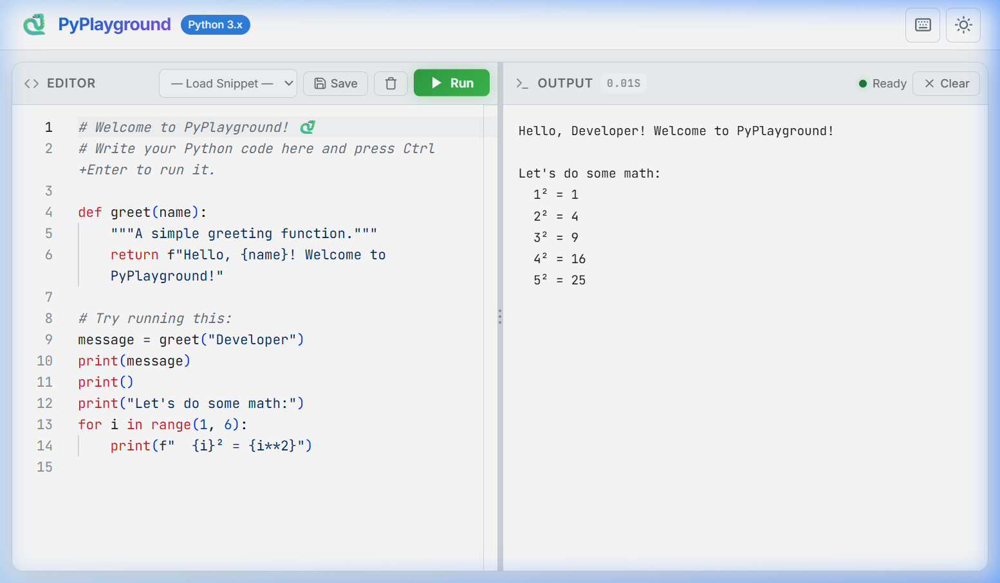
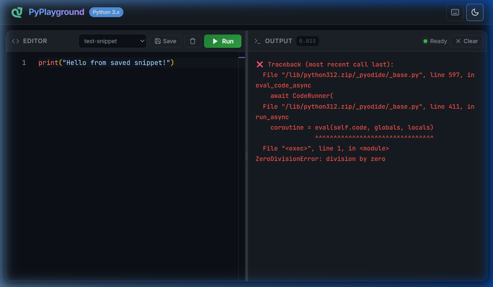
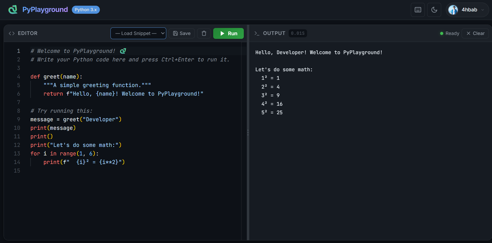
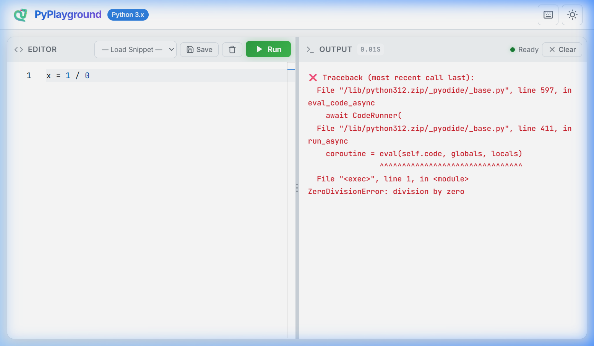
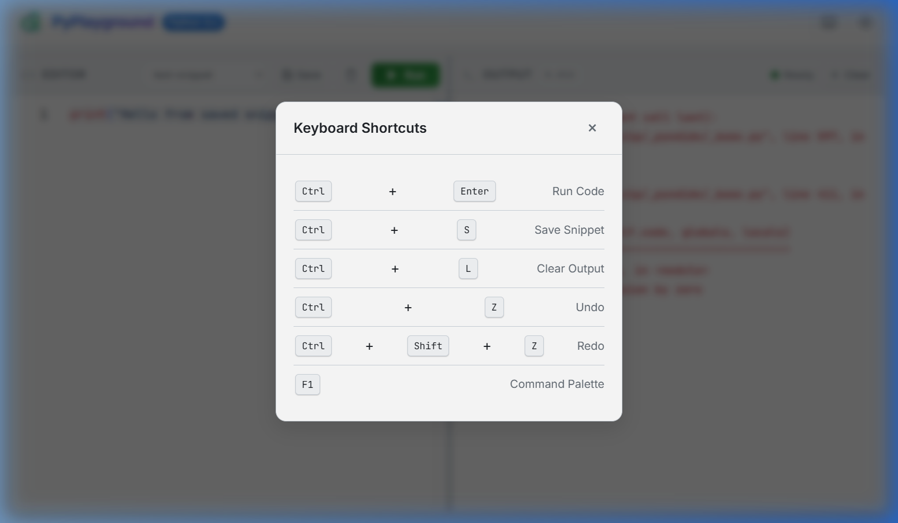

# 🐍 PyPlayground — Python Coding Playground

A browser-based Python coding playground built with **Go** (backend) and **Pyodide** (client-side Python WASM). Write, run, and debug Python code directly in your browser.

## 📸 Screenshots

### Dark Theme — Code Execution


### Light Theme


### GitHub Authentication


### Error Handling — Full Tracebacks


### Keyboard Shortcuts


## 🚀 Quick Start

```bash
# Set up environment variables
cp .env.example .env

# Run the development server
go run ./cmd/server/main.go

# Open in your browser
# http://localhost:8080
```

## 🏗️ Architecture

```
┌──────────────────────────────────────────────┐
│                  Browser                      │
│                                               │
│  ┌───────────┐  ┌───────────┐  ┌──────────┐ │
│  │  Monaco    │  │ Pyodide   │  │ Local    │ │
│  │  Editor    │  │ Web Worker│  │ Storage  │ │
│  │  (Code)    │  │ (Python)  │  │(Snippets)│ │
│  └─────┬─────┘  └─────┬─────┘  └────┬─────┘ │
│        │              │              │        │
│        └──────┬───────┴──────┬───────┘        │
│               │  app.js      │                │
│               │ (Controller) │                │
└───────────────┼──────────────┼────────────────┘
                │   HTTP       │
                ▼              │
┌───────────────────────────────────────────────┐
│              Go Server (Chi)                   │
│                                                │
│  cmd/server/main.go                            │
│  ├── internal/server/          (Router)        │
│  ├── internal/handler/         (Handlers)      │
│  ├── internal/service/         (Bus. Logic)    │
│  ├── internal/repository/      (SQLite Layer)  │
│  └── web/                      (Templates+CSS) │
└──────────────────────┬────────────────────────┘
                       │
                       ▼
┌───────────────────────────────────────────────┐
│               SQLite Database                  │
│               data/playground.db               │
│                                                │
│  ┌───────────┐  ┌───────────┐                 │
│  │  users    │  │ snippets  │                 │
│  └───────────┘  └───────────┘                 │
└───────────────────────────────────────────────┘
```

## ✨ Features

- **Python Execution** — Run Python code in your browser via Pyodide WASM
- **Monaco Editor** — VS Code-grade editor with syntax highlighting
- **GitHub Authentication** — Secure OAuth sign-in with JWT session management
- **Cloud Snippet Storage** — Save/load code snippets to a SQLite database tied to your GitHub account
- **Local Snippet Storage** — Fallback anonymous storage to localStorage
- **Error Display** — Python tracebacks with line numbers
- **Execution Timeout** — Prevents infinite loops from freezing the browser
- **Dark/Light Theme** — Toggle with a click
- **Keyboard Shortcuts** — Ctrl+Enter to run, Ctrl+S to save

## 📂 Project Structure

| Directory | Purpose |
|-----------|---------|
| `cmd/server/` | Application entry point |
| `internal/handler/` | HTTP request handlers |
| `internal/middleware/` | Request logging & JWT auth middleware |
| `internal/model/` | Data structures |
| `internal/service/` | Core business logic (Auth, Snippets) |
| `internal/repository/` | SQLite database access layer |
| `internal/server/` | Router and server setup |
| `web/templates/` | Go HTML templates |
| `web/static/` | CSS, JS, and assets |

## 🧠 Go Concepts Covered

- HTTP server with Chi router
- Database Access Object (DAO) pattern with `database/sql`
- OAuth 2.0 Flow implementation
- JWT parsing, claiming, and validation
- Middleware pattern (logging, recovery, auth)
- `html/template` composition
- `encoding/json` marshalling/unmarshalling
- Goroutines and channels
- Graceful shutdown with signals
- `slog` structured logging

## 📝 License

MIT
