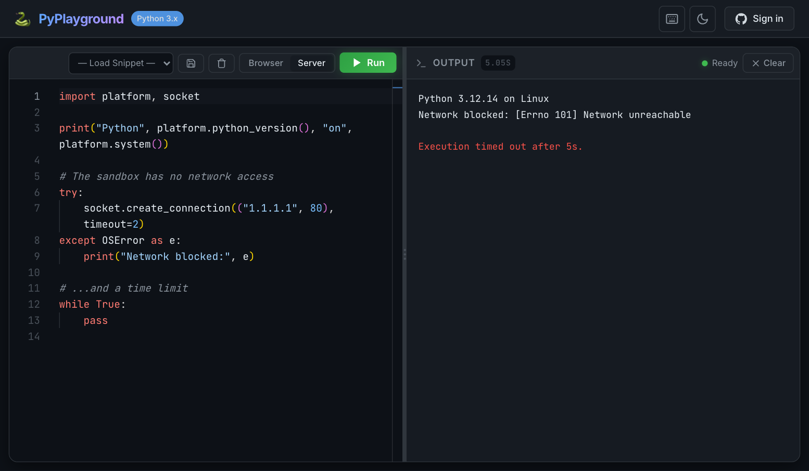
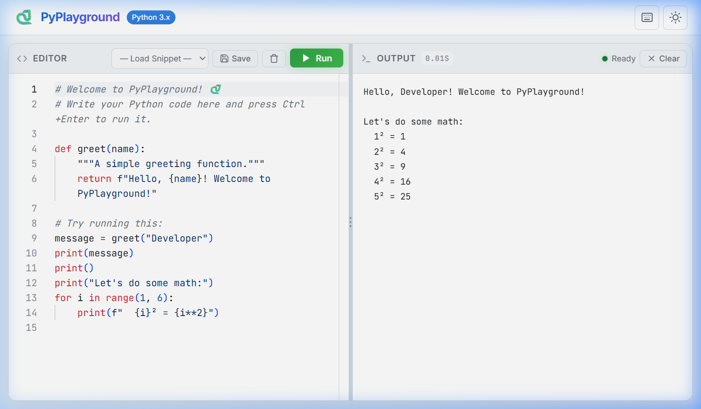
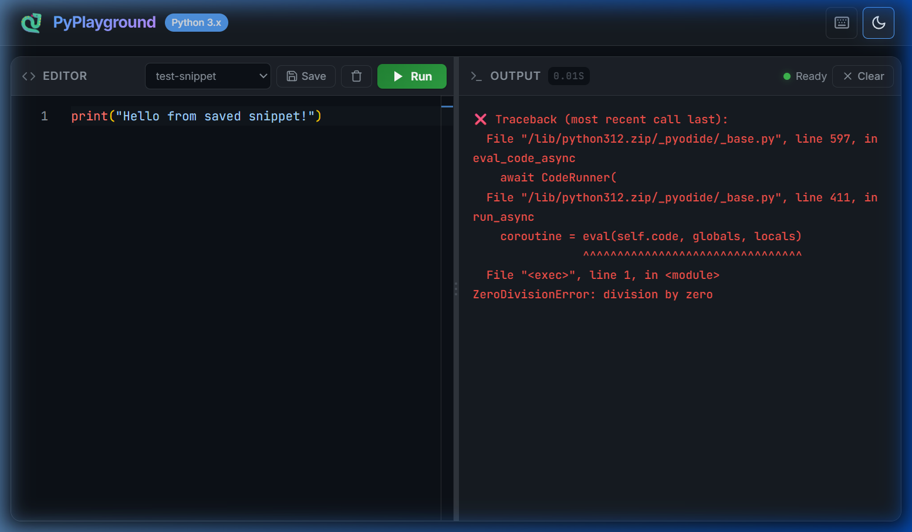
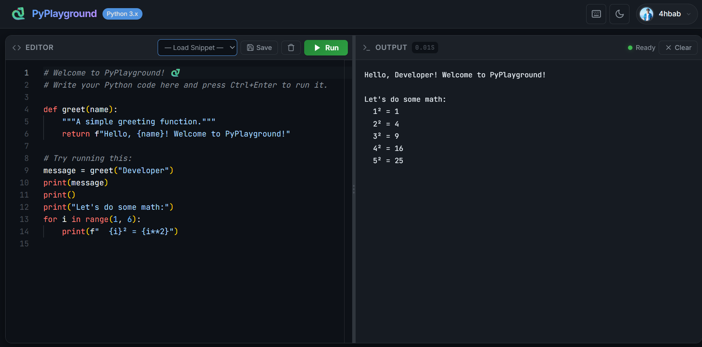
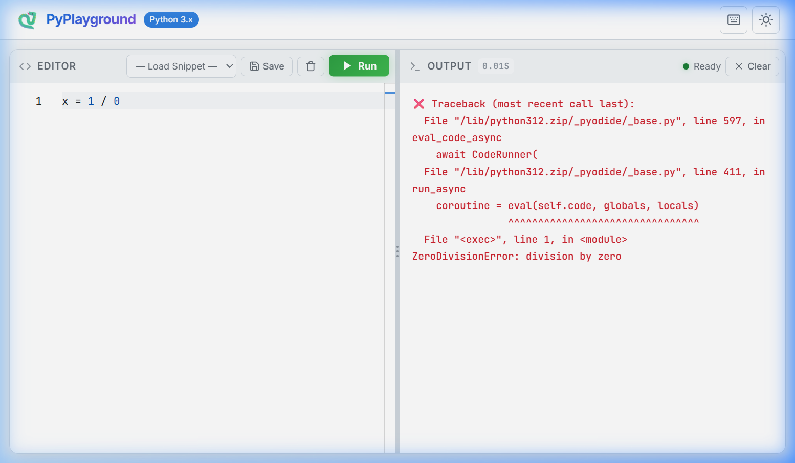
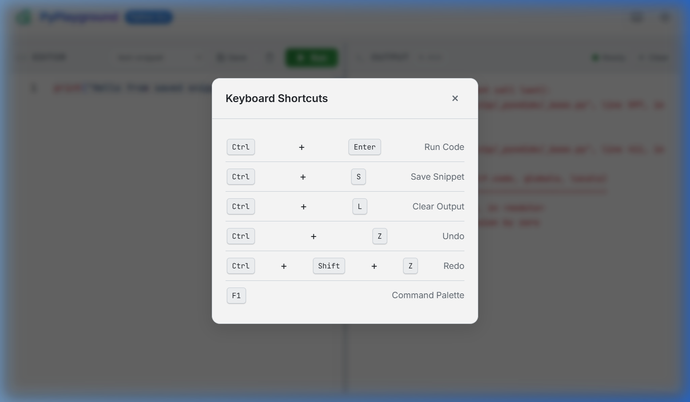
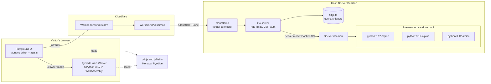
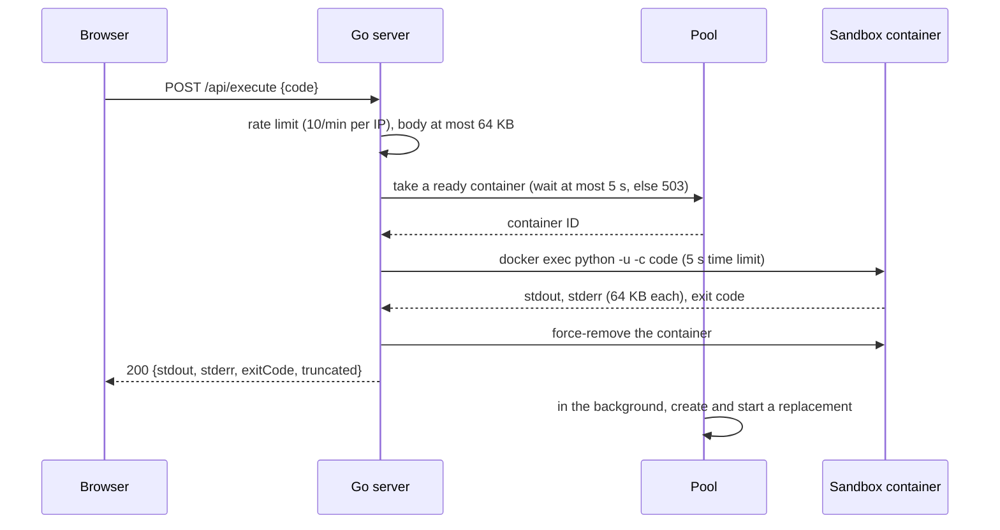

# 🐍 PyPlayground — Python Coding Playground

A Python playground with a **Go** backend. Code runs either **in the browser** (CPython compiled
to WebAssembly by [Pyodide](https://pyodide.org)) or **on the server** in a locked-down Docker
container, and you switch between the two with one click.

**Live:** <https://pyplayground.crowdpulse-labs.workers.dev> (hosted on a personal Mac, so it's
up while that Mac is on; otherwise you'll see an "offline" page)

- [Screenshots](#-screenshots)
- [Architecture](#-architecture)
- [Design decisions](#-design-decisions) — two ways to run Python, pool warm-up, sandbox limits
- [Trade-offs](#-trade-offs)
- [What's not done](#-whats-not-done)
- [Running it locally](#-running-it-locally) · [Configuration](#-configuration) · [Deployment](#-deployment)
- [API](docs/API.md) · [Testing](#-testing) · [Project structure](#-project-structure)

## 📸 Screenshots

### Server mode — the sandbox has no network and a time limit


### Dark theme — code execution in the browser


### Light theme


### GitHub authentication


### Error handling — full tracebacks


### Keyboard shortcuts


## 🏗️ Architecture


```mermaid
flowchart LR
    subgraph browser["Visitor's browser"]
        ui["Playground UI<br/>Monaco editor + app.js"]
        pyodide["Pyodide Web Worker<br/>CPython 3.12 in WebAssembly"]
    end

    cdn["cdnjs and jsDelivr<br/>Monaco, Pyodide"]

    subgraph cloudflare["Cloudflare"]
        worker["Worker on workers.dev"]
        vpc["Workers VPC service"]
    end

    subgraph host["Host: Docker Desktop"]
        cloudflared["cloudflared<br/>tunnel connector"]
        app["Go server<br/>rate limits, CSP, auth"]
        db[("SQLite<br/>users, snippets")]
        docker["Docker daemon"]
        subgraph pool["Pre-warmed sandbox pool"]
            s1["python:3.12-alpine"]
            s2["python:3.12-alpine"]
            s3["python:3.12-alpine"]
        end
    end

    ui -- "Browser mode" --> pyodide
    ui -. "loads" .-> cdn
    pyodide -. "loads" .-> cdn
    ui -- "HTTPS" --> worker
    worker --> vpc
    vpc -- "Cloudflare Tunnel" --> cloudflared
    cloudflared --> app
    app --> db
    app -- "Server mode: Docker API" --> docker
    docker --> pool
```

**Browser mode** never touches the server: `app.js` posts the code to a Web Worker running
Pyodide, which streams stdout/stderr back. **Server mode** sends the code to `POST /api/execute`:


```mermaid
sequenceDiagram
    participant B as Browser
    participant S as Go server
    participant P as Pool
    participant C as Sandbox container
    B->>S: POST /api/execute {code}
    S->>S: rate limit (10/min per IP), body at most 64 KB
    S->>P: take a ready container (wait at most 5 s, else 503)
    P-->>S: container ID
    S->>C: docker exec python -u -c code (5 s time limit)
    C-->>S: stdout, stderr (64 KB each), exit code
    S->>C: force-remove the container
    S-->>B: 200 {stdout, stderr, exitCode, truncated}
    P->>P: in the background, create and start a replacement
```

In production the host is not exposed to the internet at all: visitors reach a Cloudflare
Worker, which forwards to the app through a private [Workers VPC](https://developers.cloudflare.com/workers-vpc/)
binding and a Cloudflare Tunnel. The host has no ports open to the internet.

Inside the Go server the code is layered so each part can be tested on its own:

| Layer | Package | Job |
|---|---|---|
| HTTP | `internal/server`, `internal/middleware`, `internal/handler` | Routing, rate limiting, security headers, JSON in/out |
| Business logic | `internal/service` | Validation and rules for snippets and sign-in |
| Data | `internal/repository/sqlite` | SQL queries, migrations |
| Code execution | `internal/executor` (interface), `internal/executor/docker` | Runs code in a sandbox and enforces the limits |

Handlers depend on the `executor.Executor` interface, not on Docker, so another sandbox
(gVisor, Firecracker, a hosted sandbox service) could replace it without touching the HTTP code.

## 🧭 Design decisions

### Two ways to run Python, and why both

| | Browser (Pyodide) | Server (Docker sandbox) |
|---|---|---|
| Where the code runs | The visitor's device; the code never leaves it | The server; the code is sent over the network |
| First use | Downloads 5.3 MB from jsDelivr; ready in about 1.8 s on a fast connection, cached afterwards | Ready immediately |
| Run `print("hi")` | about 10 ms | about 100 ms end to end (median) |
| Python | 3.12.7 compiled to WebAssembly (`sys.platform == "emscripten"`) | CPython 3.12.14 on Linux |
| What doesn't work | `subprocess`, real threads, sockets and anything else the browser can't do; speed depends on the device | Network access (on purpose); `input()` |
| Limits | 10 s, then the worker is killed and restarted | 5 s, 128 MB, 0.5 CPU and more ([below](#sandbox-limits)) |
| Cost to the host | None | CPU and memory for every run |
| Can the server trust the result? | No, the visitor controls their browser | Yes |

*Measured on an Apple M5 Mac (16 GB) with Docker Desktop and a fresh browser profile.*

**Browser is the default.** It costs the server nothing, keeps code private, and a runaway
loop only freezes the visitor's own worker. For a playground that is what most runs need.

**Server mode exists for what the browser can't do.** It runs the standard CPython on Linux
(so behavior matches a real machine), works right away on slow devices and connections
without waiting for the 5 MB download, and produces a result the server itself saw. That last point is what any
future feature that checks answers (exercises, tests, grading) would need, since a result
computed in the browser can be faked.

The toggle only appears when the server reports Docker is available (`GET /api/config`),
so the site degrades to browser-only when it isn't.

### Pool warm-up

Every run gets a **brand-new container** that is deleted afterwards, so nothing (files,
processes, memory) carries over between runs or users. Creating and starting a container is
the slow part, so the server keeps a pool of 3 containers already running `sleep infinity`.
A request takes one, runs `python -u -c <code>` in it with `docker exec`, and removes it; a
background goroutine starts a replacement.

| Per run, including removing the container | Time |
|---|---|
| Cold: create + start + run | about 150 ms |
| Warm: run in a pre-started container | about 65–70 ms |

*`go test -run '^$' -bench . ./internal/executor/docker/` ([bench_test.go](internal/executor/docker/bench_test.go)), same machine as above.*

The warm pool roughly halves the time per run. An idle pooled container uses about 0.5 MB of
memory and no CPU, so keeping three ready is cheap. The pool size is also the number of runs
that can happen at once: when more requests arrive, they wait for replacements (each about a
cold start), and after 5 s of waiting the server answers `503` with `Retry-After` rather than
hanging.

### Sandbox limits

Running strangers' code is the riskiest thing this app does, so every limit below is set on
the container (see [`hostConfig`](internal/executor/docker/pool.go) and
[`DefaultConfig`](internal/executor/docker/config.go)) and has a test that tries to break it
in a real container ([sandbox_test.go](internal/executor/docker/sandbox_test.go)), plus a unit
test on the settings that runs without Docker ([limits_test.go](internal/executor/docker/limits_test.go)).

| Limit | Value | What happens when code hits it |
|---|---|---|
| Time | 5 s | Stopped; exit code 124 and "Execution timed out after 5s." Output printed before that is kept |
| Memory | 128 MB, no swap | Killed by the kernel; exit code 137 and a message about the memory limit |
| CPU | 0.5 of a core | Runs slower |
| Processes | 64 | `fork()` fails, so fork bombs stop |
| Network | None (no routes) | Every connection fails immediately |
| Output | 64 KB per stream | The rest is discarded and the result is marked `truncated` |
| Filesystem | Read-only, except a 16 MB `/tmp` where nothing can be executed | Writes fail |
| Privileges | Runs as `nobody`, all Linux capabilities dropped, `no-new-privileges` | No way to become root |
| Code size | 64 KB | `413` before the code reaches Docker |
| Runs per visitor | 10 per minute per IP | `429` with `Retry-After` |

The limits were also checked in reverse: turning off the network, memory, process and
capability settings makes the matching tests fail.

Other hardening for a public site:

- **Rate limiting** on every route (300 requests per minute per IP, 10 for `/api/execute` and
  sign-in), with `X-RateLimit-*` headers.
- **Visitor IP** is read from one header that the Cloudflare Worker sets (`CLIENT_IP_HEADER`),
  never from headers visitors can send themselves, so the rate limit can't be dodged.
- **Security headers**: a Content-Security-Policy that denies everything by default and allows
  only what the page loads, HSTS over HTTPS, `nosniff`, and no framing.
- **Sessions** are a JWT in an HttpOnly, SameSite=Lax cookie (Secure over HTTPS), so page
  scripts can't read it. The OAuth `state` parameter is checked against a cookie to stop CSRF.
- **Private snippets**: a snippet saved while signed in can only be listed, read, changed or
  deleted by its owner. For anyone else it looks like it doesn't exist (`404`, not `403`), so
  IDs can't be probed. Snippets saved without an account are a shared scratch space, and the
  UI says so.

## ⚖️ Trade-offs

- **Docker socket access is equivalent to root on the host.** The app needs it to start
  sandboxes. The app runs as a non-root user, and on a Mac the "host" is Docker Desktop's
  Linux VM rather than macOS, but a container escape or an app compromise would still reach
  that host. Stronger isolation would run sandboxes under gVisor or in microVMs, on a machine
  that holds nothing else.
- **Containers share the host's kernel.** The limits above stop resource abuse and the usual
  escapes, but a kernel bug is not covered.
- **One machine.** SQLite, the in-memory rate limiter and the sandbox pool all live in one
  process, so the app can't be scaled out as is, and rate-limit counters reset on restart.
- **Fixed-window rate limiting** is simple and makes the headers exact, but allows a burst of
  up to twice the limit across a window boundary.
- **Output over the limit is discarded, not stopped.** The program keeps running until it
  ends or hits the time limit; memory use stays bounded either way, and exit codes stay real.
- **Code is passed as a command-line argument** (`python -c`), which is simple and needs no
  files, but caps code size and gives no stdin, so `input()` doesn't work on the server.
- **Monaco and Pyodide come from public CDNs.** That keeps the repo small but means the page
  depends on cdnjs and jsDelivr. The CSP allows inline styles because Monaco injects them;
  inline scripts stay blocked.
- **Hosted on a personal Mac** to keep it free: the site is up only while the Mac is on and awake.

## 🚧 What's not done

- **No `input()` / stdin** and no extra packages (`pip`) in server mode.
- **Stronger isolation** (gVisor or microVMs) and a sandbox host separate from the app.
- **The sandbox image isn't pinned** to a digest (`python:3.12-alpine` can change under us),
  unlike the app's own base images.
- **Snippet request bodies have no size cap** (only `/api/execute` does); the 100,000-character
  code rule is checked after the body is read.
- **No end-to-end browser tests in CI.** The UI was checked with headless Chrome by hand.
- **No session refresh**: the 1-hour token expires and you sign in again.
- **UI text isn't translatable**; it's written directly in the HTML and JS.
- **No backups** of the SQLite database, and no metrics beyond logs.
- **Removing a used container happens before the response is sent**, which adds to each
  server run's latency; it could be done in the background.

## 🚀 Running it locally

You need **Go 1.25+**. **Docker** is optional: without it the server still starts, with
browser mode only.

```bash
make run          # http://localhost:8080
```

`make run` loads `.env` if there is one and finds Docker Desktop's socket automatically.

To enable **GitHub sign-in**, create an OAuth app at <https://github.com/settings/developers>
with the callback URL `http://localhost:8080/auth/github/callback`, then:

```bash
cp .env.example .env    # set JWT_SECRET (openssl rand -hex 32), GITHUB_CLIENT_ID, GITHUB_CLIENT_SECRET
make run
```

On Windows, `.\start.ps1` does the same.

| Command | What it does |
|---|---|
| `make test` | All tests with the race detector (Docker tests skip if Docker isn't running) |
| `make lint` | golangci-lint, same version as CI |
| `make ci` | Everything CI runs: vet, lint, and tests that require Docker |
| `go test -run '^$' -bench . ./internal/executor/docker/` | Pool warm-up benchmarks |

## ⚙️ Configuration

All settings are environment variables.

| Variable | Default | Meaning |
|---|---|---|
| `PORT` | `8080` | Port to listen on |
| `DB_PATH` | `data/playground.db` | SQLite file |
| `PUBLIC_URL` | `http://localhost:<PORT>` | The address visitors use. `https://` turns on secure cookies and HSTS, and sets the OAuth callback |
| `CLIENT_IP_HEADER` | *(none)* | The one header trusted to carry the visitor's IP. Set only behind a proxy that sets it |
| `JWT_SECRET` | *(none)* | Signs session tokens. Without it, sign-in is off |
| `GITHUB_CLIENT_ID`, `GITHUB_CLIENT_SECRET` | *(none)* | GitHub OAuth app. Without them, sign-in is off |
| `GITHUB_CALLBACK_URL` | `PUBLIC_URL` + `/auth/github/callback` | Override the OAuth callback |
| `RATE_LIMIT_DEFAULT` | `300` | Requests per minute per IP |
| `RATE_LIMIT_STRICT` | `10` | Requests per minute per IP for `/api/execute` and `/auth/*` |
| `LOG_LEVEL` | `debug` | `debug`, `info`, `warn` or `error` |
| `LOG_FORMAT` | `text` | `text` or `json` |
| `DOCKER_HOST` | Docker's default | Docker socket; `make` sets it for Docker Desktop |

The sandbox limits are code, not settings: see [`DefaultConfig`](internal/executor/docker/config.go).

## ☁️ Deployment

The production stack is [`docker-compose.yml`](docker-compose.yml): the app, built from the
[`Dockerfile`](Dockerfile) (a static Go binary on Alpine, running as a non-root user), and
`cloudflared`, which connects the host to Cloudflare. Visitors use the Cloudflare Worker's
`workers.dev` address; the Worker adds the visitor's IP as `X-Client-IP` and forwards the
request through a Workers VPC service to the tunnel.

```bash
cp .env.production.example .env.production        # fill in PUBLIC_URL, secrets and TUNNEL_TOKEN
docker compose --profile tunnel up -d --build     # app + tunnel
docker compose down                               # stops everything and removes the sandboxes
```

Without `--profile tunnel`, only the app starts, on `http://127.0.0.1:8080`. SQLite lives in the
`app-data` volume, so it survives restarts and rebuilds.

Setting up the Cloudflare side (tunnel, VPC service, Worker), keeping the site up on a Mac,
backups and troubleshooting: **[docs/DEPLOY.md](docs/DEPLOY.md)**.

## 🧪 Testing

- **Unit tests** for handlers, services, middleware (rate limiting, client IP, headers), JWT
  and the sandbox settings. They need nothing installed.
- **Integration tests** against real SQLite (in memory) and a real Docker daemon: every sandbox
  limit is attacked from inside a container.
- **CI** ([.github/workflows/ci.yml](.github/workflows/ci.yml)) runs `go mod verify`, `go vet`,
  golangci-lint (with `gosec`, `errorlint`, `bodyclose`), all tests with `-race` on a runner
  with Docker (`REQUIRE_DOCKER=1`, so the sandbox tests can't be skipped silently), and a
  Docker image build.

## 📂 Project structure

| Path | Purpose |
|---|---|
| `cmd/server/` | Entry point: reads settings, wires everything together |
| `internal/server/` | Router, middleware order, graceful shutdown |
| `internal/middleware/` | Request logging, rate limiting, client IP, security headers |
| `internal/handler/` | HTTP handlers (pages, snippets, auth, execute, config, health) |
| `internal/service/` | Business rules for snippets and sign-in |
| `internal/auth/` | GitHub OAuth, JWT tokens, auth middleware |
| `internal/executor/` | The `Executor` interface; `docker/` holds the sandbox, pool and limits |
| `internal/repository/` | Storage interfaces; `sqlite/` holds the SQLite implementation and migrations |
| `internal/model/`, `internal/apperror/` | Data types and domain errors |
| `web/templates/`, `web/static/` | HTML templates, CSS and JavaScript (including the Pyodide worker) |
| `worker/` | Cloudflare Worker: the public entry point, forwards to the app through Workers VPC |
| `docs/API.md`, `docs/DEPLOY.md` | HTTP API specification; deployment guide |

## 🧠 Go concepts covered

HTTP server with the Chi router · middleware (logging, recovery, auth, rate limiting) ·
`database/sql` with a repository layer · OAuth 2.0 and JWT · `html/template` · goroutines,
channels and `context` timeouts (the sandbox pool) · the Docker SDK · table-driven tests,
integration tests, benchmarks and the race detector · graceful shutdown · `slog` structured logging

## 📝 License

MIT
